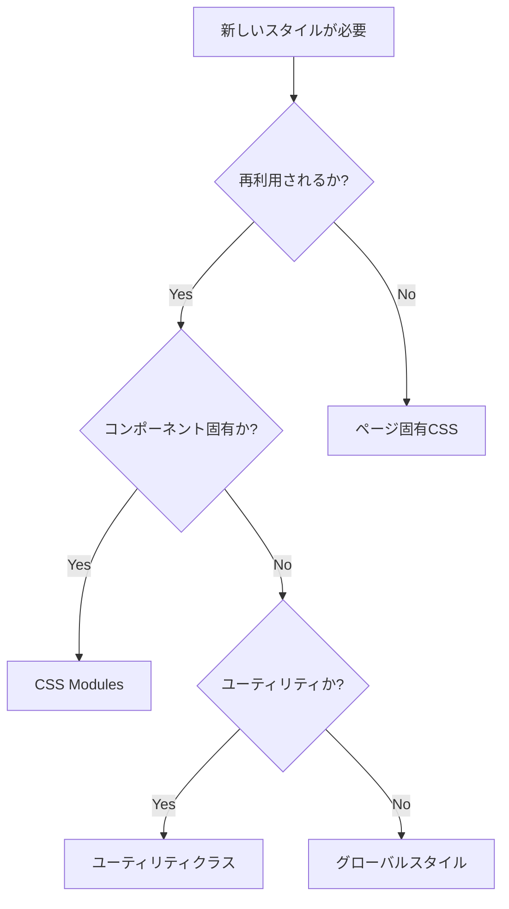

# CSS運用ガイドライン

## 🎉 CSS設計整理完了（2025年6月25日）

**整理された内容:**

- ✅ 重複ファイルの削除: `pages/global.css`, `styles/pages/index.css`
- ✅ 不要ディレクトリの削除: `styles/pages/`
- ✅ BEM記法から現代的CSS設計への移行完了
- ✅ CSS Modules + ユーティリティクラスの統一運用
- ✅ ファイル構成の最適化と責任分担の明確化

**現在のCSS構成 (8ファイル):**

```
styles/globals/          # グローバルスタイル (5ファイル)
├── index.css           # エントリーポイント
├── variables.css       # CSS変数
├── reset.css          # リセット
├── typography.css     # タイポグラフィ
└── utilities.css      # ユーティリティクラス

components/             # CSS Modules (3ファイル)
├── layout/Header/Header.module.css
├── ui/Button/Button.module.css
└── ui/Card/Card.module.css
```

## 📋 目次

1. [概要](#概要)
2. [CSS Architecture](#css-architecture)
3. [ファイル構造](#ファイル構造)
4. [運用ルール](#運用ルール)
5. [命名規則](#命名規則)
6. [CSS Variables](#css-variables)
7. [CSS Modules](#css-modules)
8. [ユーティリティクラス](#ユーティリティクラス)
9. [レスポンシブデザイン](#レスポンシブデザイン)
10. [開発ワークフロー](#開発ワークフロー)
11. [トラブルシューティング](#トラブルシューティング)
12. [Components運用](#components運用)
13. [TypeScript / React規約](#typescript--react規約)
14. [HTMLマークアップ規約](#htmlマークアップ規約)
15. [画像・アセット命名規約](#画像アセット命名規約)

## 概要

このプロジェクトでは、**モダンなCSS設計手法**を採用し、保守性・拡張性・パフォーマンスを重視したCSS運用を行います。

### 🎯 設計方針

- **CSS Variables** による一貫したデザインシステム
- **CSS Modules** によるコンポーネント単位のスタイル管理
- **ユーティリティクラス** による効率的なレイアウト構築
- **モバイルファーストアプローチ** によるレスポンシブデザイン

### 🛠️ 使用技術

- **PostCSS** - CSS変換とプラグイン
- **Autoprefixer** - ベンダープレフィックス自動付与
- **Stylelint** - CSSのリンティング
- **Prettier** - コードフォーマット

## CSS Architecture

**🎯 整理完了済みの現代的CSS設計**

```
styles/globals/                    # グローバルスタイル (最小限)
├── index.css                     # エントリーポイント
├── variables.css                 # CSS Variables
├── reset.css                     # CSSリセット
├── typography.css                # タイポグラフィ
└── utilities.css                 # ユーティリティクラス

components/                       # CSS Modules (コンポーネント固有)
├── layout/Header/Header.module.css
├── ui/Button/Button.module.css
└── ui/Card/Card.module.css
```

### 読み込み順序

1. **CSS Variables** - 全体で使用する変数定義
2. **CSS Reset** - ベースとなるリセット
3. **Typography** - フォント関連スタイル
4. **Utilities** - ユーティリティクラス

## ファイル構造

### 📁 グローバルスタイル

```css
/* styles/globals/index.css */
@import url('./variables.css');
@import url('./reset.css');
@import url('./typography.css');
@import url('./utilities.css');
```

### 📁 コンポーネントスタイル

```
components/
├── layout/Header/
│   ├── Header.tsx
│   ├── Header.module.css    # CSS Modules (camelCase)
│   └── index.ts
├── ui/Button/
│   ├── Button.tsx
│   ├── Button.module.css    # CSS Modules
│   └── index.ts
└── ui/Card/
    ├── Card.tsx
    ├── Card.module.css      # CSS Modules
    └── index.ts
```

### 📁 ページ構成 (CSS Modules + ユーティリティクラス)

```
pages/
├── index/
│   └── +Page.tsx           # ユーティリティクラスでスタイリング
└── about/
    └── +Page.tsx           # ユーティリティクラスでスタイリング
```

**重要:** ページ固有のCSSファイルは削除され、コンポーネント内でユーティリティクラスを使用する方式に統一しました。

## 運用ルール

### 1. スタイルの優先順位

1. **CSS Variables** - デザインシステムの値
2. **CSS Modules** - コンポーネント固有スタイル
3. **ユーティリティクラス** - レイアウト調整
4. **インラインスタイル** - 動的な値（極力避ける）

### 2. ファイル命名規則

- **CSS Modules**: `Component.module.css`
- **グローバルスタイル**: `kebab-case.css`
- **ページスタイル**: `page-name.css`

### 3. 新しいスタイルを追加する際の判断基準



## 命名規則

### CSS Variables

```css
/* パターン: --[category]-[property]-[variant] */
--color-primary        /* カラー */
--spacing-md          /* スペーシング */
--font-size-lg        /* フォントサイズ */
--shadow-sm           /* シャドウ */
```

### CSS Modules

```css
/* camelCase を使用 */
.primaryButton {
}
.headerNavigation {
}
.cardContainer {
}
```

### ユーティリティクラス

```css
/* kebab-case を使用 */
.text-center {
}
.flex-col {
}
.mt-4 {
}
```

### BEM記法（必要に応じて）

```css
/* Block__Element--Modifier */
.card {
}
.card__header {
}
.card__header--large {
}
```

## CSS Variables

### 🎨 カラーパレット

```css
/* Primary Colors */
--color-primary: #667eea;
--color-secondary: #764ba2;
--color-accent: #3498db;

/* Text Colors */
--color-text: #333333;
--color-text-light: #666666;
--color-text-muted: #999999;
--color-text-inverse: #ffffff;

/* Status Colors */
--color-success: #27ae60;
--color-warning: #f39c12;
--color-error: #e74c3c;
```

### 📐 スペーシング

```css
--spacing-xs: 0.5rem; /* 8px */
--spacing-sm: 1rem; /* 16px */
--spacing-md: 1.5rem; /* 24px */
--spacing-lg: 2rem; /* 32px */
--spacing-xl: 3rem; /* 48px */
--spacing-2xl: 4rem; /* 64px */
```

### 📝 タイポグラフィ

```css
--font-size-xs: 0.75rem; /* 12px */
--font-size-sm: 0.875rem; /* 14px */
--font-size-base: 1rem; /* 16px */
--font-size-lg: 1.125rem; /* 18px */
--font-size-xl: 1.25rem; /* 20px */
--font-size-2xl: 1.5rem; /* 24px */
```

### 使用例

```css
.button {
    padding: var(--spacing-sm) var(--spacing-md);
    font-size: var(--font-size-base);
    color: var(--color-text-inverse);
    background: var(--color-primary);
    border-radius: var(--radius-md);
}
```

## CSS Modules

### 基本的な使用方法

```tsx
// Button.module.css
.button {
    padding: var(--spacing-sm) var(--spacing-md);
    border-radius: var(--radius-md);
    font-weight: var(--font-weight-medium);
    transition: all var(--transition-normal);
}

.primary {
    background: var(--color-primary);
    color: var(--color-text-inverse);
}

.secondary {
    background: transparent;
    color: var(--color-primary);
    border: 1px solid var(--color-primary);
}
```

```tsx
// Button.tsx
import styles from './Button.module.css';

interface ButtonProps {
    variant?: 'primary' | 'secondary';
    children: React.ReactNode;
}

export const Button = ({ variant = 'primary', children }: ButtonProps) => {
    return (
        <button className={`${styles.button} ${styles[variant]}`}>
            {children}
        </button>
    );
};
```

### 条件付きクラス名

```tsx
import styles from './Component.module.css';
import clsx from 'clsx'; // Optional: for better class name handling

const Component = ({ isActive, size }) => {
    return (
        <div
            className={clsx(
                styles.component,
                isActive && styles.active,
                styles[size]
            )}
        >
            Content
        </div>
    );
};
```

## ユーティリティクラス

### レイアウト

```css
/* Display */
.flex {
    display: flex;
}
.grid {
    display: grid;
}
.block {
    display: block;
}
.hidden {
    display: none;
}

/* Flexbox */
.flex-col {
    flex-direction: column;
}
.flex-row {
    flex-direction: row;
}
.justify-center {
    justify-content: center;
}
.items-center {
    align-items: center;
}
.justify-between {
    justify-content: space-between;
}

/* Grid */
.grid-cols-2 {
    grid-template-columns: repeat(2, 1fr);
}
.grid-cols-3 {
    grid-template-columns: repeat(3, 1fr);
}
.gap-4 {
    gap: var(--spacing-lg);
}
```

### スペーシング

```css
/* Margin */
.m-0 {
    margin: 0;
}
.mt-4 {
    margin-top: var(--spacing-lg);
}
.mb-4 {
    margin-bottom: var(--spacing-lg);
}
.mx-auto {
    margin-left: auto;
    margin-right: auto;
}

/* Padding */
.p-4 {
    padding: var(--spacing-lg);
}
.px-4 {
    padding-left: var(--spacing-lg);
    padding-right: var(--spacing-lg);
}
.py-4 {
    padding-top: var(--spacing-lg);
    padding-bottom: var(--spacing-lg);
}
```

### タイポグラフィ

```css
/* Font Size */
.text-sm {
    font-size: var(--font-size-sm);
}
.text-lg {
    font-size: var(--font-size-lg);
}
.text-2xl {
    font-size: var(--font-size-2xl);
}

/* Font Weight */
.font-medium {
    font-weight: var(--font-weight-medium);
}
.font-bold {
    font-weight: var(--font-weight-bold);
}

/* Text Alignment */
.text-center {
    text-align: center;
}
.text-left {
    text-align: left;
}
.text-right {
    text-align: right;
}
```

### 使用例

```tsx
<div className="flex flex-col items-center gap-4 p-6">
    <h1 className="text-2xl font-bold text-center">タイトル</h1>
    <p className="text-lg text-muted">説明文</p>
    <button className="btn btn-primary">ボタン</button>
</div>
```

## レスポンシブデザイン

### ブレークポイント

```css
/* Mobile First アプローチ */
:root {
    --breakpoint-sm: 640px;
    --breakpoint-md: 768px;
    --breakpoint-lg: 1024px;
    --breakpoint-xl: 1200px;
}
```

### メディアクエリの使用

```css
/* Mobile First */
.component {
    /* モバイル用スタイル（ベース） */
    padding: var(--spacing-sm);
    font-size: var(--font-size-base);
}

@media (min-width: 768px) {
    .component {
        /* タブレット用スタイル */
        padding: var(--spacing-md);
        font-size: var(--font-size-lg);
    }
}

@media (min-width: 1024px) {
    .component {
        /* デスクトップ用スタイル */
        padding: var(--spacing-lg);
        font-size: var(--font-size-xl);
    }
}
```

### レスポンシブユーティリティ

```css
/* Display */
@media (max-width: 768px) {
    .md\:hidden {
        display: none;
    }
    .md\:block {
        display: block;
    }
}

/* Flexbox */
@media (max-width: 768px) {
    .md\:flex-col {
        flex-direction: column;
    }
}
```

### 使用例

```tsx
<div className="grid grid-cols-1 md:grid-cols-2 lg:grid-cols-3 gap-4">
    <div className="p-4 md:p-6">
        <h2 className="text-lg md:text-xl lg:text-2xl">レスポンシブタイトル</h2>
    </div>
</div>
```

## 開発ワークフロー

### 1. スタイル追加の手順

```bash
# 1. 新しいコンポーネントの場合
mkdir components/NewComponent
touch components/NewComponent/NewComponent.tsx
touch components/NewComponent/NewComponent.module.css

# 2. スタイルの実装
# 3. Stylelintによるチェック
pnpm lint:css

# 4. Prettierによるフォーマット
pnpm format
```

### 2. 利用可能なスクリプト

```json
{
    "scripts": {
        "dev": "vike dev",
        "build": "vike build",
        "format": "prettier --write .",
        "format:check": "prettier --check .",
        "lint:css": "stylelint \"**/*.css\" --fix",
        "lint:css:check": "stylelint \"**/*.css\""
    }
}
```

### 3. VSCode設定

```json
{
    "editor.formatOnSave": true,
    "editor.codeActionsOnSave": {
        "source.fixAll.stylelint": true
    },
    "[css]": {
        "editor.defaultFormatter": "esbenp.prettier-vscode"
    }
}
```

## トラブルシューティング

### よくある問題と解決方法

#### 1. CSS Modulesのクラス名が適用されない

**問題**: CSS Modulesのクラスが正しく適用されない

**解決方法**:

```tsx
// ❌ 間違い
<div className="button">

// ✅ 正しい
import styles from './Component.module.css';
<div className={styles.button}>
```

#### 2. CSS Variablesが効かない

**問題**: カスタムプロパティが認識されない

**解決方法**:

```css
/* variables.cssが正しくインポートされているか確認 */
@import url('./variables.css');

/* フォールバック値を指定 */
color: var(--color-primary, #667eea);
```

#### 3. スタイルの優先順位問題

**問題**: スタイルが期待通りに適用されない

**解決方法**:

```css
/* 詳細度を上げる */
.component.component {
    /* スタイル */
}

/* または !important（最後の手段） */
.component {
    color: red !important;
}
```

#### 4. レスポンシブが効かない

**問題**: メディアクエリが動作しない

**解決方法**:

```html
<!-- HTMLのheadにviewportメタタグが必要 -->
<meta name="viewport" content="width=device-width, initial-scale=1.0" />
```

### デバッグ方法

1. **開発者ツール**で計算されたスタイルを確認
2. **CSS Modules**のクラス名が正しく生成されているか確認
3. **CSS Variables**の値が正しく設定されているか確認
4. **メディアクエリ**のブレークポイントが正しいか確認

## Components運用

ここでは、コンポーネントに関連するスタイルの運用ルールについて説明します。

### 🏗️ コンポーネント構造

```
components/
├── ui/                    # 基本UIコンポーネント
│   ├── Button/
│   │   ├── Button.tsx
│   │   ├── Button.module.css
│   │   └── index.ts
│   └── Card/
│       ├── Card.tsx
│       ├── Card.module.css
│       └── index.ts
├── layout/                # レイアウト関連
│   └── Header/
│       ├── Header.tsx
│       ├── Header.module.css
│       └── index.ts
├── features/              # 機能固有のコンポーネント
└── common/                # 共通コンポーネント
```

### 📋 運用ルール

#### 1. **命名規則**

- **コンポーネント名**: PascalCase (`Button`, `CardHeader`)
- **ファイル名**: PascalCase (`Button.tsx`, `Card.module.css`)
- **CSS クラス名**: camelCase (`button`, `primaryVariant`)

#### 2. **ファイル構成**

```
ComponentName/
├── ComponentName.tsx         # コンポーネント本体
├── ComponentName.module.css  # CSS Modules
└── index.ts                 # エクスポート用ファイル
```

#### 3. **プロパティの設計**

- **必須プロパティ**: 最小限に抑える
- **オプショナル**: デフォルト値を提供
- **拡張性**: `...props` で HTML属性を受け取る
- **型安全性**: TypeScript の interface を定義

#### 4. **CSS Modules運用**

- **CSS Variables**: グローバル変数を積極活用
- **レスポンシブ**: Mobile First アプローチ
- **アクセシビリティ**: focus, hover, active 状態を考慮

#### 5. **コンポーネントの分類**

- **ui/**: 再利用可能な基本コンポーネント（Button, Card, Input等）
- **layout/**: レイアウト関連コンポーネント（Header, Footer等）
- **features/**: 機能固有のコンポーネント
- **common/**: 共通ユーティリティコンポーネント

### 💡 実装例

#### Buttonコンポーネント

```tsx
import { ReactNode, ButtonHTMLAttributes } from 'react';
import styles from './Button.module.css';

export interface ButtonProps extends ButtonHTMLAttributes<HTMLButtonElement> {
    variant?: 'primary' | 'secondary' | 'outline' | 'ghost';
    size?: 'sm' | 'md' | 'lg';
    fullWidth?: boolean;
    loading?: boolean;
    children: ReactNode;
}

export const Button = ({
    variant = 'primary',
    size = 'md',
    fullWidth = false,
    loading = false,
    className,
    disabled,
    children,
    ...props
}: ButtonProps) => {
    const buttonClasses = [
        styles.button,
        styles[variant],
        styles[size],
        fullWidth ? styles.fullWidth : '',
        loading ? styles.loading : '',
        className || '',
    ]
        .filter(Boolean)
        .join(' ');

    return (
        <button
            className={buttonClasses}
            disabled={disabled || loading}
            {...props}
        >
            {loading && <span className={styles.spinner} />}
            <span className={styles.content}>{children}</span>
        </button>
    );
};
```

#### 対応するCSS

```css
.button {
    display: inline-flex;
    align-items: center;
    justify-content: center;
    gap: var(--spacing-xs);
    border: none;
    border-radius: var(--radius-md);
    font-weight: var(--font-weight-medium);
    transition: all var(--transition-normal);
    cursor: pointer;
}

.primary {
    background: linear-gradient(
        135deg,
        var(--color-primary) 0%,
        var(--color-secondary) 100%
    );
    color: var(--color-text-inverse);
}

.md {
    padding: var(--spacing-sm) var(--spacing-md);
    font-size: var(--font-size-base);
    min-height: 44px;
}
```

### 🔄 使用方法

#### コンポーネントのインポート

```tsx
// 個別インポート
import { Button } from '../../components/ui/Button';
import { Card, CardBody } from '../../components/ui/Card';

// 統合インポート
import { Button, Card, CardBody } from '../../components';
```

#### 使用例

```tsx
<Card variant="elevated" hoverable>
    <CardBody>
        <h3>タイトル</h3>
        <p>説明文</p>
        <Button variant="primary" size="lg">
            アクション
        </Button>
    </CardBody>
</Card>
```

### ⚠️ 注意点

1. **CSS Modules**: 必ずCSS Modulesを使用してスコープを分離
2. **CSS Variables**: グローバル変数を活用してデザインの一貫性を保つ
3. **アクセシビリティ**: セマンティックなHTMLとARIA属性を適切に使用
4. **レスポンシブ**: モバイルファーストでレスポンシブ対応
5. **パフォーマンス**: 不要なre-renderを避ける設計
6. **React.FC禁止**: `React.FC`の使用は禁止。代わりに関数宣言を使用

### 🚫 React.FCが禁止される理由

`React.FC`（React.FunctionComponent）は以下の理由で使用を禁止します：

- **デフォルトのchildren**: 不要な`children`プロパティが自動的に追加される
- **Generic型の制限**: 型引数を受け取れない
- **displayName問題**: デバッグ時の表示名が期待通りにならない場合がある
- **React18との非互換**: 将来的に非推奨になる可能性

#### ❌ 悪い例（使用禁止）

```tsx
// React.FCは使用禁止
export const Button: React.FC<ButtonProps> = ({ children }) => {
    return <button>{children}</button>;
};
```

#### ✅ 良い例（推奨）

```tsx
// アロー関数による宣言（推奨）
export const Button = ({ children }: ButtonProps) => {
    return <button>{children}</button>;
};
```

### 🔧 関数宣言の使い分け

#### アロー関数（推奨）

```tsx
// ✅ Reactコンポーネント（推奨）
export const Button = ({ children }: ButtonProps) => {
    return <button>{children}</button>;
};

// ✅ カスタムフック
export const useToggle = (initialValue = false) => {
    const [value, setValue] = useState(initialValue);
    return { value, toggle: () => setValue(!value) };
};

// ✅ イベントハンドラー
const handleClick = () => {
    console.log('clicked');
};
```

#### Function宣言（特定の場面のみ）

```tsx
// ✅ Vikeフレームワークのdata関数（フレームワーク規約）
export default async function data(): Promise<Data> {
    return {
        /* データ */
    };
}

// ✅ エラーバウンダリ（クラスベースが必要）
export class ErrorBoundary extends Component {
    // ...
}

// ✅ ホイスティングが必要な場合（稀）
function helperFunction() {
    // 定義前に呼び出される必要がある関数
}
```

## TypeScript / React規約

このセクションでは、TypeScriptとReactの使用における規約とベストプラクティスを定義します。

### 🎯 基本方針

- **型安全性**: TypeScriptの型システムを最大限活用
- **モダンReact**: 最新のReactの機能と記法を使用
- **関数コンポーネント**: クラスコンポーネントは使用禁止
- **Hooks**: 状態管理とライフサイクルはHooksを使用
- **アロー関数優先**: コンポーネントはアロー関数で定義（フレームワーク規約除く）

### 📋 コンポーネント記法規約

#### ✅ 推奨（アロー関数）

```tsx
// アロー関数による宣言（推奨）
export const Button = ({ variant, children }: ButtonProps) => {
    return <button className={styles[variant]}>{children}</button>;
};
```

#### 🚫 禁止事項

```tsx
// React.FC は使用禁止
export const Button: React.FC<ButtonProps> = ({ children }) => {
    return <button>{children}</button>;
};

// React.FunctionComponent も使用禁止
export const Button: React.FunctionComponent<ButtonProps> = ({ children }) => {
    return <button>{children}</button>;
};

// クラスコンポーネントは使用禁止
class Button extends React.Component<ButtonProps> {
    render() {
        return <button>{this.props.children}</button>;
    }
}
```

### 🔧 Propsの型定義

#### インターフェース定義

```tsx
// 基本的なPropsインターフェース
export interface ButtonProps {
    variant?: 'primary' | 'secondary';
    size?: 'sm' | 'md' | 'lg';
    disabled?: boolean;
    children: ReactNode;
}

// HTML属性を継承する場合
export interface ButtonProps extends ButtonHTMLAttributes<HTMLButtonElement> {
    variant?: 'primary' | 'secondary';
    loading?: boolean;
    children: ReactNode;
}

// 汎用的なProps
export interface ComponentProps<T = HTMLDivElement> extends HTMLAttributes<T> {
    variant?: string;
    children?: ReactNode;
}
```

#### オプショナルプロパティの扱い

```tsx
// デフォルト値を関数パラメータで設定（推奨）
export const Button = ({
    variant = 'primary',
    size = 'md',
    disabled = false,
    children,
    ...props
}: ButtonProps) => {
    // ...
};
```

### 📚 Import/Export規約

#### Import順序

```tsx
// 1. React関連
import { ReactNode, useState, useEffect } from 'react';

// 2. 外部ライブラリ
import clsx from 'clsx';

// 3. 内部モジュール（相対パス順）
import { utils } from '../../../utils';
import { Button } from '../Button';
import styles from './Component.module.css';
```

#### Export方法

```tsx
// Named Export（推奨）
export const Button = () => { /* ... */ };
export interface ButtonProps = () => { /* ... */ };

// 末尾でのexport（OK）
const Button = () => { /* ... */ };
interface ButtonProps = () => { /* ... */ }

export { Button };
export type { ButtonProps };
```

### 🎣 Hooks使用規約

#### カスタムHooks

```tsx
// カスタムHookの命名は "use" で始める
export const useToggle = (initialValue = false) => {
    const [value, setValue] = useState(initialValue);

    const toggle = useCallback(() => setValue(prev => !prev), []);
    const setTrue = useCallback(() => setValue(true), []);
    const setFalse = useCallback(() => setValue(false), []);

    return { value, toggle, setTrue, setFalse };
};
```

#### useEffectの使用

```tsx
// 依存配列は必ず記述
useEffect(() => {
    // effect logic
}, [dependency1, dependency2]);

// 空の依存配列でマウント時のみ実行
useEffect(() => {
    // mount logic
}, []);

// クリーンアップ関数
useEffect(() => {
    const subscription = subscribe();

    return () => {
        subscription.unsubscribe();
    };
}, []);
```

### 🔍 型定義のベストプラクティス

#### Union型の活用

```tsx
// 文字列リテラル型でvariantを制限
type ButtonVariant = 'primary' | 'secondary' | 'outline' | 'ghost';

// オブジェクトのキーから型を生成
const SIZES = {
    small: 'sm',
    medium: 'md',
    large: 'lg',
} as const;

type ButtonSize = (typeof SIZES)[keyof typeof SIZES]; // 'sm' | 'md' | 'lg'
```

#### 条件付き型

```tsx
// プロパティの組み合わせを制御
interface BaseButtonProps {
    children: ReactNode;
    disabled?: boolean;
}

interface LoadingButtonProps extends BaseButtonProps {
    loading: true;
    onClick?: never; // loading時はonClickを無効化
}

interface NormalButtonProps extends BaseButtonProps {
    loading?: false;
    onClick: () => void;
}

type ButtonProps = LoadingButtonProps | NormalButtonProps;
```

### 🛡️ エラーハンドリング

#### Error Boundary

```tsx
// Error Boundaryコンポーネント
export class ErrorBoundary extends Component<
    { children: ReactNode; fallback?: ReactNode },
    { hasError: boolean }
> {
    constructor(props: { children: ReactNode; fallback?: ReactNode }) {
        super(props);
        this.state = { hasError: false };
    }

    static getDerivedStateFromError(): { hasError: boolean } {
        return { hasError: true };
    }

    componentDidCatch(error: Error, errorInfo: ErrorInfo) {
        console.error('Error caught by boundary:', error, errorInfo);
    }

    render() {
        if (this.state.hasError) {
            return this.props.fallback || <div>Something went wrong.</div>;
        }

        return this.props.children;
    }
}
```

### 📏 命名規則

- **コンポーネント**: PascalCase (`Button`, `UserProfile`)
- **Props**: PascalCase + "Props" (`ButtonProps`, `UserProfileProps`)
- **関数**: camelCase (`handleClick`, `fetchUserData`)
- **定数**: UPPER_SNAKE_CASE (`MAX_RETRY_COUNT`, `API_ENDPOINTS`)
- **カスタムHooks**: camelCase + "use" prefix (`useAuth`, `useLocalStorage`)

### ⚡ パフォーマンス考慮事項

#### メモ化

```tsx
// React.memo for component memoization
export const ExpensiveComponent = memo(({ data }: Props) => {
    return <div>{/* expensive rendering */}</div>;
});

// useMemo for expensive calculations
const expensiveValue = useMemo(() => {
    return expensiveCalculation(data);
}, [data]);

// useCallback for function memoization
const handleClick = useCallback(
    (id: string) => {
        onItemClick(id);
    },
    [onItemClick]
);
```

## 🏆 CSS整理・最適化の成果

### ✅ 達成された改善点

**1. ファイル構成の最適化**

- 重複ファイル2つを削除: `pages/global.css`, `styles/pages/index.css`
- 不要ディレクトリ削除: `styles/pages/`
- 責任の明確化: グローバル(5) + CSS Modules(3) = 計8ファイル

**2. 現代的CSS設計への移行**

- BEM記法 → CSS Modules + ユーティリティクラス
- 大きなグローバルCSS → 最小限のベーススタイル
- スタイル衝突リスクの解消

**3. 保守性の向上**

- コンポーネント単位の局所化
- 明確な命名規則の統一
- TypeScript型安全性の確保

**4. パフォーマンス最適化**

- 未使用CSSの削除
- バンドルサイズの最適化
- 効率的なCSS読み込み順序

### 📊 Before / After

| 項目          | Before             | After                            |
| ------------- | ------------------ | -------------------------------- |
| CSSファイル数 | 10ファイル         | **8ファイル**                    |
| 重複ファイル  | ✅ 2つ存在         | **❌ 削除完了**                  |
| 設計手法      | BEM記法中心        | **CSS Modules + ユーティリティ** |
| グローバルCSS | 大量のスタイル     | **最小限のベース**               |
| 保守性        | スタイル衝突リスク | **局所化・スコープ化**           |
