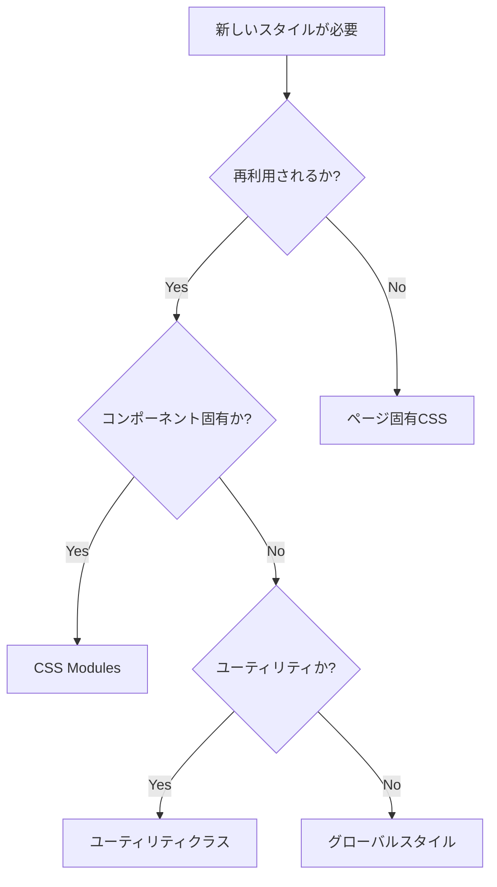

# CSS運用ガイドライン

## 📋 目次

1. [概要](#概要)
2. [CSS Architecture](#css-architecture)
3. [ファイル構造](#ファイル構造)
4. [運用ルール](#運用ルール)
5. [命名規則](#命名規則)
6. [CSS Variables](#css-variables)
7. [CSS Modules](#css-modules)
8. [ユーティリティクラス](#ユーティリティクラス)
9. [レスポンシブデザイン](#レスポンシブデザイン)
10. [開発ワークフロー](#開発ワークフロー)
11. [トラブルシューティング](#トラブルシューティング)

## 概要

このプロジェクトでは、**モダンなCSS設計手法**を採用し、保守性・拡張性・パフォーマンスを重視したCSS運用を行います。

### 🎯 設計方針

- **CSS Variables** による一貫したデザインシステム
- **CSS Modules** によるコンポーネント単位のスタイル管理
- **ユーティリティクラス** による効率的なレイアウト構築
- **モバイルファーストアプローチ** によるレスポンシブデザイン

### 🛠️ 使用技術

- **PostCSS** - CSS変換とプラグイン
- **Autoprefixer** - ベンダープレフィックス自動付与
- **Stylelint** - CSSのリンティング
- **Prettier** - コードフォーマット

## CSS Architecture

```
styles/
├── globals/
│   ├── index.css         # エントリーポイント
│   ├── variables.css     # CSS Variables
│   ├── reset.css         # CSSリセット
│   ├── typography.css    # タイポグラフィ
│   └── utilities.css     # ユーティリティクラス
├── components/           # コンポーネント固有スタイル
└── pages/               # ページ固有スタイル
```

### 読み込み順序

1. **CSS Variables** - 全体で使用する変数定義
2. **CSS Reset** - ベースとなるリセット
3. **Typography** - フォント関連スタイル
4. **Utilities** - ユーティリティクラス

## ファイル構造

### 📁 グローバルスタイル

```css
/* styles/globals/index.css */
@import url('./variables.css');
@import url('./reset.css');
@import url('./typography.css');
@import url('./utilities.css');
```

### 📁 コンポーネントスタイル

```
components/
├── Button/
│   ├── Button.tsx
│   ├── Button.module.css    # CSS Modules
│   └── index.ts
└── Header/
    ├── Header.tsx
    ├── Header.module.css
    └── index.ts
```

### 📁 ページスタイル

```
pages/
├── index/
│   ├── +Page.tsx
│   └── index.css           # ページ固有スタイル
└── about/
    ├── +Page.tsx
    └── about.css
```

## 運用ルール

### 1. スタイルの優先順位

1. **CSS Variables** - デザインシステムの値
2. **CSS Modules** - コンポーネント固有スタイル
3. **ユーティリティクラス** - レイアウト調整
4. **インラインスタイル** - 動的な値（極力避ける）

### 2. ファイル命名規則

- **CSS Modules**: `Component.module.css`
- **グローバルスタイル**: `kebab-case.css`
- **ページスタイル**: `page-name.css`

### 3. 新しいスタイルを追加する際の判断基準



## 命名規則

### CSS Variables

```css
/* パターン: --[category]-[property]-[variant] */
--color-primary        /* カラー */
--spacing-md          /* スペーシング */
--font-size-lg        /* フォントサイズ */
--shadow-sm           /* シャドウ */
```

### CSS Modules

```css
/* camelCase を使用 */
.primaryButton {
}
.headerNavigation {
}
.cardContainer {
}
```

### ユーティリティクラス

```css
/* kebab-case を使用 */
.text-center {
}
.flex-col {
}
.mt-4 {
}
```

### BEM記法（必要に応じて）

```css
/* Block__Element--Modifier */
.card {
}
.card__header {
}
.card__header--large {
}
```

## CSS Variables

### 🎨 カラーパレット

```css
/* Primary Colors */
--color-primary: #667eea;
--color-secondary: #764ba2;
--color-accent: #3498db;

/* Text Colors */
--color-text: #333333;
--color-text-light: #666666;
--color-text-muted: #999999;
--color-text-inverse: #ffffff;

/* Status Colors */
--color-success: #27ae60;
--color-warning: #f39c12;
--color-error: #e74c3c;
```

### 📐 スペーシング

```css
--spacing-xs: 0.5rem; /* 8px */
--spacing-sm: 1rem; /* 16px */
--spacing-md: 1.5rem; /* 24px */
--spacing-lg: 2rem; /* 32px */
--spacing-xl: 3rem; /* 48px */
--spacing-2xl: 4rem; /* 64px */
```

### 📝 タイポグラフィ

```css
--font-size-xs: 0.75rem; /* 12px */
--font-size-sm: 0.875rem; /* 14px */
--font-size-base: 1rem; /* 16px */
--font-size-lg: 1.125rem; /* 18px */
--font-size-xl: 1.25rem; /* 20px */
--font-size-2xl: 1.5rem; /* 24px */
```

### 使用例

```css
.button {
    padding: var(--spacing-sm) var(--spacing-md);
    font-size: var(--font-size-base);
    color: var(--color-text-inverse);
    background: var(--color-primary);
    border-radius: var(--radius-md);
}
```

## CSS Modules

### 基本的な使用方法

```tsx
// Button.module.css
.button {
    padding: var(--spacing-sm) var(--spacing-md);
    border-radius: var(--radius-md);
    font-weight: var(--font-weight-medium);
    transition: all var(--transition-normal);
}

.primary {
    background: var(--color-primary);
    color: var(--color-text-inverse);
}

.secondary {
    background: transparent;
    color: var(--color-primary);
    border: 1px solid var(--color-primary);
}
```

```tsx
// Button.tsx
import styles from './Button.module.css';

interface ButtonProps {
    variant?: 'primary' | 'secondary';
    children: React.ReactNode;
}

export const Button: React.FC<ButtonProps> = ({
    variant = 'primary',
    children,
}) => {
    return (
        <button className={`${styles.button} ${styles[variant]}`}>
            {children}
        </button>
    );
};
```

### 条件付きクラス名

```tsx
import styles from './Component.module.css';
import clsx from 'clsx'; // Optional: for better class name handling

const Component = ({ isActive, size }) => {
    return (
        <div
            className={clsx(
                styles.component,
                isActive && styles.active,
                styles[size]
            )}
        >
            Content
        </div>
    );
};
```

## ユーティリティクラス

### レイアウト

```css
/* Display */
.flex {
    display: flex;
}
.grid {
    display: grid;
}
.block {
    display: block;
}
.hidden {
    display: none;
}

/* Flexbox */
.flex-col {
    flex-direction: column;
}
.flex-row {
    flex-direction: row;
}
.justify-center {
    justify-content: center;
}
.items-center {
    align-items: center;
}
.justify-between {
    justify-content: space-between;
}

/* Grid */
.grid-cols-2 {
    grid-template-columns: repeat(2, 1fr);
}
.grid-cols-3 {
    grid-template-columns: repeat(3, 1fr);
}
.gap-4 {
    gap: var(--spacing-lg);
}
```

### スペーシング

```css
/* Margin */
.m-0 {
    margin: 0;
}
.mt-4 {
    margin-top: var(--spacing-lg);
}
.mb-4 {
    margin-bottom: var(--spacing-lg);
}
.mx-auto {
    margin-left: auto;
    margin-right: auto;
}

/* Padding */
.p-4 {
    padding: var(--spacing-lg);
}
.px-4 {
    padding-left: var(--spacing-lg);
    padding-right: var(--spacing-lg);
}
.py-4 {
    padding-top: var(--spacing-lg);
    padding-bottom: var(--spacing-lg);
}
```

### タイポグラフィ

```css
/* Font Size */
.text-sm {
    font-size: var(--font-size-sm);
}
.text-lg {
    font-size: var(--font-size-lg);
}
.text-2xl {
    font-size: var(--font-size-2xl);
}

/* Font Weight */
.font-medium {
    font-weight: var(--font-weight-medium);
}
.font-bold {
    font-weight: var(--font-weight-bold);
}

/* Text Alignment */
.text-center {
    text-align: center;
}
.text-left {
    text-align: left;
}
.text-right {
    text-align: right;
}
```

### 使用例

```tsx
<div className="flex flex-col items-center gap-4 p-6">
    <h1 className="text-2xl font-bold text-center">タイトル</h1>
    <p className="text-lg text-muted">説明文</p>
    <button className="btn btn-primary">ボタン</button>
</div>
```

## レスポンシブデザイン

### ブレークポイント

```css
/* Mobile First アプローチ */
:root {
    --breakpoint-sm: 640px;
    --breakpoint-md: 768px;
    --breakpoint-lg: 1024px;
    --breakpoint-xl: 1200px;
}
```

### メディアクエリの使用

```css
/* Mobile First */
.component {
    /* モバイル用スタイル（ベース） */
    padding: var(--spacing-sm);
    font-size: var(--font-size-base);
}

@media (min-width: 768px) {
    .component {
        /* タブレット用スタイル */
        padding: var(--spacing-md);
        font-size: var(--font-size-lg);
    }
}

@media (min-width: 1024px) {
    .component {
        /* デスクトップ用スタイル */
        padding: var(--spacing-lg);
        font-size: var(--font-size-xl);
    }
}
```

### レスポンシブユーティリティ

```css
/* Display */
@media (max-width: 768px) {
    .md\:hidden {
        display: none;
    }
    .md\:block {
        display: block;
    }
}

/* Flexbox */
@media (max-width: 768px) {
    .md\:flex-col {
        flex-direction: column;
    }
}
```

### 使用例

```tsx
<div className="grid grid-cols-1 md:grid-cols-2 lg:grid-cols-3 gap-4">
    <div className="p-4 md:p-6">
        <h2 className="text-lg md:text-xl lg:text-2xl">レスポンシブタイトル</h2>
    </div>
</div>
```

## 開発ワークフロー

### 1. スタイル追加の手順

```bash
# 1. 新しいコンポーネントの場合
mkdir components/NewComponent
touch components/NewComponent/NewComponent.tsx
touch components/NewComponent/NewComponent.module.css

# 2. スタイルの実装
# 3. Stylelintによるチェック
pnpm lint:css

# 4. Prettierによるフォーマット
pnpm format
```

### 2. 利用可能なスクリプト

```json
{
    "scripts": {
        "dev": "vike dev",
        "build": "vike build",
        "format": "prettier --write .",
        "format:check": "prettier --check .",
        "lint:css": "stylelint \"**/*.css\" --fix",
        "lint:css:check": "stylelint \"**/*.css\""
    }
}
```

### 3. VSCode設定

```json
{
    "editor.formatOnSave": true,
    "editor.codeActionsOnSave": {
        "source.fixAll.stylelint": true
    },
    "[css]": {
        "editor.defaultFormatter": "esbenp.prettier-vscode"
    }
}
```

## トラブルシューティング

### よくある問題と解決方法

#### 1. CSS Modulesのクラス名が適用されない

**問題**: CSS Modulesのクラスが正しく適用されない

**解決方法**:

```tsx
// ❌ 間違い
<div className="button">

// ✅ 正しい
import styles from './Component.module.css';
<div className={styles.button}>
```

#### 2. CSS Variablesが効かない

**問題**: カスタムプロパティが認識されない

**解決方法**:

```css
/* variables.cssが正しくインポートされているか確認 */
@import url('./variables.css');

/* フォールバック値を指定 */
color: var(--color-primary, #667eea);
```

#### 3. スタイルの優先順位問題

**問題**: スタイルが期待通りに適用されない

**解決方法**:

```css
/* 詳細度を上げる */
.component.component {
    /* スタイル */
}

/* または !important（最後の手段） */
.component {
    color: red !important;
}
```

#### 4. レスポンシブが効かない

**問題**: メディアクエリが動作しない

**解決方法**:

```html
<!-- HTMLのheadにviewportメタタグが必要 -->
<meta name="viewport" content="width=device-width, initial-scale=1.0" />
```

### デバッグ方法

1. **開発者ツール**で計算されたスタイルを確認
2. **CSS Modules**のクラス名が正しく生成されているか確認
3. **CSS Variables**の値が正しく設定されているか確認
4. **メディアクエリ**のブレークポイントが正しいか確認

## まとめ

このCSS運用ガイドラインに従うことで、以下の利点が得られます：

- ✅ **保守性の向上** - 一貫した命名規則とファイル構造
- ✅ **開発効率の向上** - ユーティリティクラスによる高速開発
- ✅ **デザインの一貫性** - CSS Variablesによるデザインシステム
- ✅ **バグの削減** - CSS ModulesによるスコープとLinting
- ✅ **パフォーマンス** - 最適化されたCSS出力

継続的な改善とチームでの共有により、より良いCSS運用を実現していきましょう！
